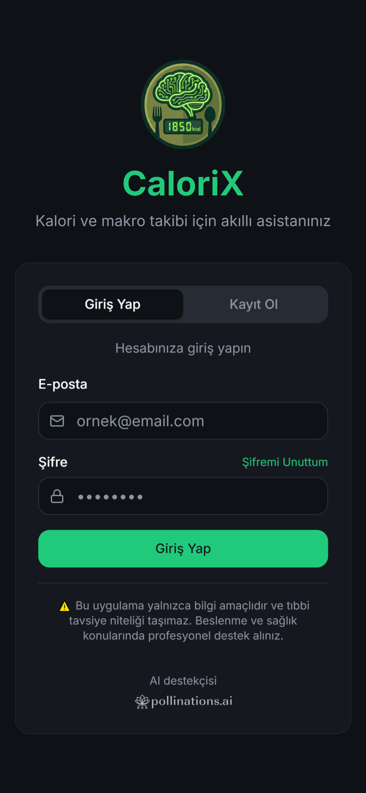
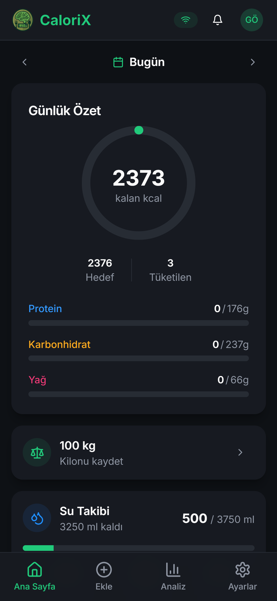
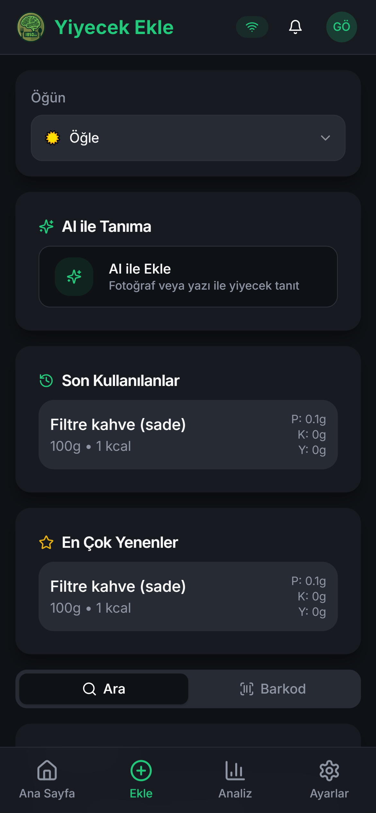
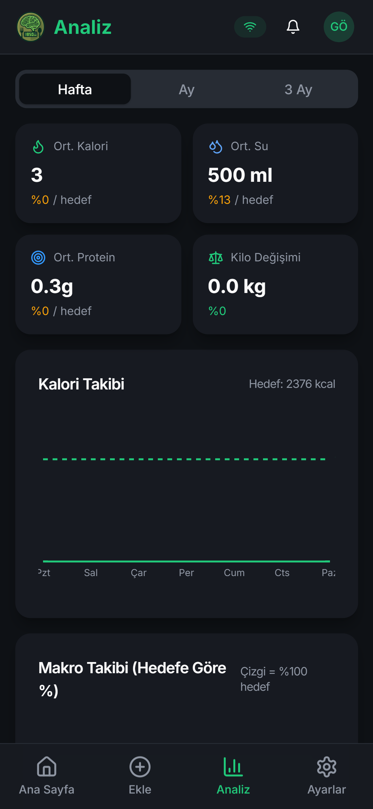

# 🔥 CaloriX

<div align="center">


**Akıllı Kalori ve Makro Takip Uygulaması**

[](https://yediginibil.vercel.app)
[](https://github.com/GokhanOfficial/CaloriX)
[](LICENSE)

[🇺🇸 English](README_EN.md)

[🚀 Demo](https://yediginibil.vercel.app) • [📖 Özellikler](#-özellikler) • [🛠️ Kurulum](#️-kurulum) • [📱 Ekran Görüntüleri](#-ekran-görüntüleri)

</div>

---

## 📖 Hakkında

CaloriX, günlük kalori, makro besin değerleri, su tüketimi ve kilo takibi yapmanızı sağlayan modern bir PWA (Progressive Web App) uygulamasıdır. AI destekli yemek tanıma özelliği ile fotoğraf çekerek veya metin yazarak yediklerinizi kolayca kaydedebilirsiniz.

## ✨ Özellikler

### 🍽️ Yemek Takibi
- **AI Destekli Tanıma**: Fotoğraf veya metin ile yemek tanıma
- **Barkod Tarama**: Paketli ürünleri barkod ile hızlıca ekleyin
- **Detaylı Besin Değerleri**: Kalori, protein, karbonhidrat, yağ ve daha fazlası
- **NOVA & Nutri-Score**: Gıda işlenme ve beslenme skorları

### 💧 Su Takibi
- Günlük su tüketimi hedefi
- Hızlı ekleme butonları
- Özel miktar girişi

### ⚖️ Kilo Takibi
- Düzenli tartılma hatırlatıcıları
- Kilo değişim grafikleri
- BMI hesaplama

### 📊 Analitik
- Haftalık, aylık ve 3 aylık trend grafikleri
- Makro dağılım analizleri
- Hedef başarı oranları

### 🔔 Bildirimler
- Push bildirim desteği
- E-posta hatırlatıcıları
- Özelleştirilebilir bildirim zamanları

### 🌙 Diğer
- Koyu/Açık tema desteği
- Offline-first mimari
- Türkçe arayüz
- PWA kurulum desteği

## 🛠️ Kurulum

### Gereksinimler

- Node.js 18+
- Bun veya npm
- Supabase hesabı

### Adımlar

1. **Repoyu klonlayın**
```bash
git clone https://github.com/GokhanOfficial/CaloriX.git
cd CaloriX
```

2. **Bağımlılıkları yükleyin**
```bash
bun install
# veya
npm install
```

3. **Ortam değişkenlerini ayarlayın**
```bash
cp .env.example .env
```

`.env` dosyasını aşağıdaki değişkenlerle yapılandırın:

| Değişken | Açıklama |
|----------|----------|
| `VITE_SUPABASE_URL` | Supabase Proje URL'i |
| `VITE_SUPABASE_PUBLISHABLE_KEY` | Supabase Anon Key |
| `VITE_SUPABASE_PROJECT_ID` | Supabase Proje ID'si |
| `OPENAI_API_KEY` | (Opsiyonel) AI özellikleri için OpenAI API anahtarı |
| `OPENAI_BASE_URL` | (Opsiyonel) OpenAI Proxy URL'i (varsayılan: https://gen.pollinations.ai/v1) |
| `OPENAI_MODEL` | (Opsiyonel) Kullanılacak AI modeli (varsayılan: gpt-5-mini) |
| `RESEND_API_KEY` | (Opsiyonel) E-posta bildirimleri için Resend API anahtarı |
| `VAPID_PUBLIC_KEY` | (Opsiyonel) Web Push bildirimleri için Public Key |
| `VAPID_PRIVATE_KEY` | (Opsiyonel) Web Push bildirimleri için Private Key |


4. **Geliştirme sunucusunu başlatın**
```bash
bun dev
# veya
npm run dev
```

5. **Tarayıcıda açın**
```
http://localhost:5173
```

## 🚀 Deployment

### Vercel ile Deploy

[](https://vercel.com/new/clone?repository-url=https://github.com/GokhanOfficial/CaloriX)

1. Vercel hesabınıza giriş yapın
2. "New Project" butonuna tıklayın
3. GitHub reposunu seçin
4. Ortam değişkenlerini ekleyin:
   - `VITE_SUPABASE_URL`
   - `VITE_SUPABASE_PUBLISHABLE_KEY`
5. "Deploy" butonuna tıklayın

### Manuel Build

```bash
bun run build
# veya
npm run build
```

Build çıktısı `dist/` klasöründe oluşturulur. Bu klasörü herhangi bir statik hosting servisine deploy edebilirsiniz.

## 🗄️ Veritabanı Kurulumu

CaloriX, backend olarak [Supabase](https://supabase.com) kullanmaktadır.

1. [Supabase](https://supabase.com) üzerinde yeni bir proje oluşturun
2. `supabase/migrations/` klasöründeki migration dosyalarını SQL editörde çalıştırın
3. Edge Functions'ları deploy edin:
```bash
supabase functions deploy
```

## 🔧 Teknolojiler

| Kategori | Teknoloji |
|----------|-----------|
| Frontend | React 18, TypeScript, Vite |
| Styling | Tailwind CSS, shadcn/ui |
| State | TanStack Query, React Context |
| Backend | Supabase (PostgreSQL, Auth, Edge Functions) |
| AI | OpenAI GPT-5-Mini, [Pollinations.ai](https://pollinations.ai) |
| Deployment | Vercel |

## 🌸 AI Destekçileri

<div align="center">

[](https://pollinations.ai/)

**[Pollinations.ai](https://pollinations.ai/)**

CaloriX, AI görsel ve metin işleme yetenekleri için [Pollinations.ai](https://pollinations.ai/) tarafından desteklenmektedir. Pollinations, ücretsiz ve açık kaynaklı AI üretim platformudur.

</div>

## 📱 Ekran Görüntüleri

<div align="center">
  <div style="display: flex; justify-content: center; gap: 20px; flex-wrap: wrap;">
    <div style="text-align: center;">
        
        <p><strong>Giriş Ekranı</strong></p>
        <p>Kullanıcı girişi ve kayıt</p>
    </div>
    <div style="text-align: center;">
        
        <p><strong>Ana Sayfa</strong></p>
        <p>Günlük özet ve hızlı erişim</p>
    </div>
    <div style="text-align: center;">
        
        <p><strong>Yemek Ekleme</strong></p>
        <p>AI ile fotoğraftan tanıma</p>
    </div>
    <div style="text-align: center;">
        
        <p><strong>Analitik</strong></p>
        <p>Trend grafikleri</p>
    </div>
  </div>
</div>

## 🤝 Katkıda Bulunma

Katkılarınızı memnuniyetle karşılıyoruz! 

1. Projeyi fork edin
2. Feature branch oluşturun (`git checkout -b feature/amazing-feature`)
3. Değişikliklerinizi commit edin (`git commit -m 'feat: Add amazing feature'`)
4. Branch'i push edin (`git push origin feature/amazing-feature`)
5. Pull Request açın

## 📄 Lisans

Bu proje MIT lisansı altında lisanslanmıştır. Detaylar için [LICENSE](LICENSE) dosyasına bakın.

## 👨‍💻 Geliştirici

<div align="center">

**Gökhan Tekyıldırım**

[](mailto:gokhantekyildirim@outlook.com)
[](https://github.com/GokhanOfficial)

</div>

---

<div align="center">

Made with ❤️ in Turkey

**[⬆ Başa Dön](#-calorix)**

</div>
